# transFINESy - Complete Technical Documentation

**Project:** transFINESy (Transforming Fines into Transparency)  

**Version:** 1.0.0  

**Technology Stack:** Spring Boot 3.2.0, Java 17, MySQL 8.0+, Thymeleaf, Bootstrap 5  

**Documentation Date:** Generated for Academic Defense

---

## Table of Contents

1. [System Overview](#1-system-overview)
2. [File Purpose Index](#2-file-purpose-index)
3. [Object-Oriented Programming Requirements](#3-object-oriented-programming-requirements)
4. [Data Structures & Algorithms Requirements](#4-data-structures--algorithms-requirements)
5. [Class Diagram](#5-class-diagram)
6. [Relationship Mapping](#6-relationship-mapping)
7. [Sorting Algorithm Documentation](#7-sorting-algorithm-documentation)
8. [Computational Logic Documentation](#8-computational-logic-documentation)
9. [Error Handling Summary](#9-error-handling-summary)
10. [Requirements → Code Mapping Summary](#10-requirements--code-mapping-summary)

---

## 1. System Overview

transFINESy is a Spring Boot web application designed to manage student fines, payments, attendance tracking, and clearance management for educational institutions. The system transforms manual fine management into a transparent, automated process with RFID-based attendance tracking.

### Architecture

The application follows a **layered architecture**:

- **Model Layer** (`com.transfinesy.model`): Domain entities and business objects
- **Repository Layer** (`com.transfinesy.repo`): Data access using JDBC with connection pooling
- **Service Layer** (`com.transfinesy.service`): Business logic and orchestration
- **Controller Layer** (`com.transfinesy.web`): Spring MVC controllers for web requests
- **View Layer** (`src/main/resources/templates`): Thymeleaf templates with Bootstrap 5

### Key Features

- Student Management (CRUD operations)
- Event Management with flexible attendance windows and **configurable fine amounts per event**
- RFID-based and Manual Attendance Tracking
- Automatic Fine Generation with **event-specific fine amounts** (configurable per event, with defaults: ABSENT: ₱100, LATE: ₱2/minute, minimum ₱20)
- Payment Recording with OR numbers
- Community Service Credits (1 hour = ₱50 credit)
- Ledger View with complete transaction history
- Clearance Management (CLEARED/WITH BALANCE)
- Transparency Dashboard with reports by course

---

## 2. File Purpose Index

### 2.1 Application Entry Point

| File | Purpose | System Part | Interactions |
|------|---------|-------------|--------------|
| `TransfinesyApplication.java` | Spring Boot application entry point. Initializes Spring context and starts the embedded Tomcat server. | Application Bootstrap | Spring Boot Framework |

### 2.2 Model Layer (`com.transfinesy.model`)

| File | Purpose | System Part | Interactions |
|------|---------|-------------|--------------|
| `Student.java` | Represents a student entity with ID, name, course, year level, section, and RFID tag. Uses encapsulation with private fields and getters/setters. | Model/Entity | Used by all repositories, services, and controllers |
| `Event.java` | Represents a school event with date, semester, school year, attendance time windows (AM/PM, Start-Stop), and configurable fine amounts (fineAmountAbsent, fineAmountLate). | Model/Entity | Used by EventRepository, AttendanceService, FineService |
| `Attendance.java` | Represents attendance record for a student at an event. Contains status (PRESENT/LATE/ABSENT/EXCUSED), minutes late, and timestamps. | Model/Entity | Used by AttendanceRepository, AttendanceService, FineService |
| `Fine.java` | Represents a fine transaction. Extends `Transaction` abstract class. Implements `getSignedAmount()` to return positive amount (increases debt). | Model/Entity (Inherits Transaction) | Used by FineRepository, FineService, LedgerService |
| `Payment.java` | Represents a payment transaction. Extends `Transaction` abstract class. Implements `getSignedAmount()` to return negative amount (reduces debt). | Model/Entity (Inherits Transaction) | Used by PaymentRepository, PaymentService, LedgerService |
| `CommunityService.java` | Represents community service record with hours rendered and credit amount. Not a Transaction subclass but contributes to ledger. | Model/Entity | Used by CommunityServiceRepository, CommunityServiceService, LedgerService |
| `Transaction.java` | Abstract base class for all financial transactions. Defines common fields (transactionID, studID, amount, date) and abstract `getSignedAmount()` method. | Model/Abstract Base Class | Extended by Fine and Payment classes |
| `Ledger.java` | Aggregates all transactions for a student. Maintains opening/closing balance, totals for fines/payments/credits. Uses ArrayList to store transactions. | Model/Aggregate | Used by LedgerService, ClearanceService |
| `AttendanceStatus.java` | Enumeration defining attendance statuses: PRESENT, LATE, ABSENT, EXCUSED. | Model/Enum | Used by Attendance, AttendanceService |
| `AttendanceSession.java` | Enumeration for event session types: MORNING_ONLY, AFTERNOON_ONLY, BOTH. | Model/Enum | Used by Event, AttendanceService |
| `ClearanceService.java` | Model class for clearance eligibility checking. Contains methods to determine if student is eligible (balance <= 0). | Model/Service Class | Used by ClearanceService (service layer), StudentRegistry |
| `StudentRegistry.java` | Registry maintaining a list of all students. Uses ArrayList for student storage. | Model/Registry | Used for dashboard operations and clearance checks |

### 2.3 Repository Layer (`com.transfinesy.repo`)

| File | Purpose | System Part | Interactions |
|------|---------|-------------|--------------|
| `StudentRepository.java` | Interface defining CRUD and search operations for Student entities. Demonstrates abstraction. | Repository Interface | Implemented by StudentRepositoryImpl, used by StudentService |
| `StudentRepositoryImpl.java` | JDBC implementation of StudentRepository. Uses ArrayList to return query results. Contains try-catch blocks for error handling. | Repository Implementation | Implements StudentRepository, uses DBConfig, called by StudentService |
| `EventRepository.java` | Interface for Event CRUD operations. | Repository Interface | Implemented by EventRepositoryImpl, used by EventService |
| `EventRepositoryImpl.java` | JDBC implementation using ArrayList for results. Handles legacy and new Start-Stop attendance fields. | Repository Implementation | Implements EventRepository, uses DBConfig, called by EventService |
| `AttendanceRepository.java` | Interface for Attendance operations including findByEvent, findByStudent. | Repository Interface | Implemented by AttendanceRepositoryImpl, used by AttendanceService |
| `AttendanceRepositoryImpl.java` | JDBC implementation. Uses ArrayList for query results. Handles scan_source field with backward compatibility. | Repository Implementation | Implements AttendanceRepository, uses DBConfig, called by AttendanceService |
| `FineRepository.java` | Interface for Fine operations. | Repository Interface | Implemented by FineRepositoryImpl, used by FineService |
| `FineRepositoryImpl.java` | JDBC implementation. Uses ArrayList for results. | Repository Implementation | Implements FineRepository, uses DBConfig, called by FineService |
| `PaymentRepository.java` | Interface for Payment operations. | Repository Interface | Implemented by PaymentRepositoryImpl, used by PaymentService |
| `PaymentRepositoryImpl.java` | JDBC implementation. Uses ArrayList for results. | Repository Implementation | Implements PaymentRepository, uses DBConfig, called by PaymentService |
| `CommunityServiceRepository.java` | Interface for CommunityService operations. | Repository Interface | Implemented by CommunityServiceRepositoryImpl, used by CommunityServiceService |
| `CommunityServiceRepositoryImpl.java` | JDBC implementation with error handling for missing description column (backward compatibility). | Repository Implementation | Implements CommunityServiceRepository, uses DBConfig, called by CommunityServiceService |

### 2.4 Service Layer (`com.transfinesy.service`)

| File | Purpose | System Part | Interactions |
|------|---------|-------------|--------------|
| `StudentService.java` | Business logic for student operations. Contains sorting algorithm (uses List.sort with custom comparator). Validates inputs and throws IllegalArgumentException. | Service | Uses StudentRepository interface, called by StudentController |
| `EventService.java` | Business logic for event management. Validates event ID before operations. | Service | Uses EventRepository interface, called by EventController |
| `AttendanceService.java` | Core attendance logic. Determines PRESENT/LATE status based on time windows. Uses Queue data structure for FIFO RFID scan processing. Contains computational logic for minutes late calculation. | Service | Uses AttendanceRepository, EventRepository, StudentRepository, FineService, RFIDService, Queue |
| `FineService.java` | Fine calculation business logic. Implements fine computation with event-specific fine amounts. Supports configurable fine amounts per event (stored in Event.fineAmountAbsent and Event.fineAmountLate). Falls back to default constants (ABSENT = ₱100, LATE = ₱2/minute, min ₱20) if event doesn't specify. | Service | Uses FineRepository, LedgerService, Event model, called by AttendanceService |
| `PaymentService.java` | Payment recording logic. Validates payment amount > 0 and OR number required. Updates ledger after payment. | Service | Uses PaymentRepository, LedgerService, called by PaymentController |
| `CommunityServiceService.java` | Community service credit calculation. Converts hours to credits (1 hour = ₱50). Validates hours > 0. | Service | Uses CommunityServiceRepository, LedgerService, called by CommunityServiceController |
| `LedgerService.java` | Aggregates all transactions into Ledger. Uses Stack data structure for recent transaction history (LIFO). Builds ledger from fines, payments, and service credits. | Service | Uses FineRepository, PaymentRepository, CommunityServiceRepository, Stack |
| `ClearanceService.java` | Clearance eligibility checking. Determines if student balance <= 0 for clearance. | Service | Uses LedgerService, called by ClearanceController |
| `ReportService.java` | Report generation and transparency dashboard data. Uses HashMap for grouping by course/year/section. Uses HashSet for student ID lookups. Contains sorting logic for top contributors. | Service | Uses FineRepository, PaymentRepository, StudentRepository, CommunityServiceRepository |
| `RFIDService.java` | RFID scanning service. Finds student by RFID tag and auto-checks in. | Service | Uses StudentRepository, AttendanceRepository, called by AttendanceService |

### 2.5 Controller Layer (`com.transfinesy.web`)

| File | Purpose | System Part | Interactions |
|------|---------|-------------|--------------|
| `HomeController.java` | Root controller for home page. | Controller | Uses no services (static page) |
| `StudentController.java` | Handles HTTP requests for student CRUD. Processes user input (search, sort parameters). Validates inputs and handles errors with flash messages. | Controller | Uses StudentService, handles user input validation |
| `EventController.java` | Handles event management requests. | Controller | Uses EventService |
| `AttendanceController.java` | Handles attendance recording (RFID and manual). Processes RFID scan input. Validates RFID tag and event ID. Returns JSON responses. | Controller | Uses AttendanceService, EventService, StudentService, processes RFID input |
| `PaymentController.java` | Handles payment recording requests. Validates payment input (amount, OR number). | Controller | Uses PaymentService, validates user input |
| `CommunityServiceController.java` | Handles community service recording. | Controller | Uses CommunityServiceService |
| `LedgerController.java` | Displays student ledger view. | Controller | Uses LedgerService |
| `ClearanceController.java` | Displays clearance status for students. | Controller | Uses ClearanceService, LedgerService |
| `DashboardController.java` | Displays dashboard statistics. | Controller | Uses ReportService, multiple services |
| `TransparencyReportController.java` | Generates transparency reports. | Controller | Uses ReportService |
| `CustomErrorController.java` | Custom error handling for application errors. Implements ErrorController interface. | Controller | Handles all application errors |

### 2.6 Utility Classes (`com.transfinesy.util`)

| File | Purpose | System Part | Interactions |
|------|---------|-------------|--------------|
| `Queue.java` | Custom generic Queue implementation (FIFO). Used for processing RFID scans in order. Uses linked list internally. | Utility/Data Structure | Used by AttendanceService for scan queue |
| `Stack.java` | Custom generic Stack implementation (LIFO). Used for managing recent transaction history. Uses linked list internally. | Utility/Data Structure | Used by LedgerService for recent transactions |
| `CSVImporter.java` | Utility for importing students from CSV files. Uses BufferedReader and ArrayList. Validates CSV format and handles errors. | Utility | Used by BulkImport, called by StudentController (if implemented) |
| `BulkImport.java` | Command-line utility for bulk student import. | Utility | Uses CSVImporter, StudentService |

### 2.7 Configuration (`com.transfinesy.config`)

| File | Purpose | System Part | Interactions |
|------|---------|-------------|--------------|
| `DBConfig.java` | Database configuration with connection pooling (HikariCP via Spring Boot DataSource). Provides static getConnection() method for repositories. Implements ApplicationContextAware. | Configuration | Used by all repository implementations |
| `PerformanceConfig.java` | Performance optimization configuration. Configures static resource caching (1 year cache period). | Configuration | Spring MVC configuration |

### 2.8 Resources

| File/Directory | Purpose | System Part | Interactions |
|----------------|---------|-------------|--------------|
| `application.properties` | Spring Boot configuration (server port, database properties). | Configuration | Read by Spring Boot |
| `db.properties` | Database connection properties (URL, user, password). | Configuration | Read by DBConfig (if used) |
| `schema.sql` | Database schema definition (CREATE TABLE statements). | Database Schema | Executed during database setup |
| `templates/*.html` | Thymeleaf HTML templates for web UI. | View Layer | Rendered by Spring MVC controllers |
| `static/css/*.css` | CSS stylesheets for UI. | View Layer | Referenced by HTML templates |
| `static/js/*.js` | JavaScript files for client-side interactivity. | View Layer | Referenced by HTML templates |

---

## 3. Object-Oriented Programming Requirements

### 3.1 Encapsulation

**Definition:** Encapsulation is the bundling of data (fields) and methods (getters/setters) within a class, hiding internal implementation details.

#### Implementation Locations:

| Class | File | Encapsulation Evidence |
|-------|------|------------------------|
| `Student` | `model/Student.java` | All fields are `private` (studID, firstName, lastName, course, yearLevel, section, rfidTag). Public getters and setters provided. |
| `Event` | `model/Event.java` | All fields are `private`. Public getters/setters for all properties. |
| `Attendance` | `model/Attendance.java` | Private fields (attendanceID, studID, eventID, status, minutesLate, checkInTime, checkOutTime, scanSource). Public accessors. |
| `Fine` | `model/Fine.java` | Private fields (fineID, eventID, fineAmount). Protected fields inherited from Transaction. |
| `Payment` | `model/Payment.java` | Private fields (paymentID, orNumber). Protected fields inherited from Transaction. |
| `CommunityService` | `model/CommunityService.java` | All fields private with getters/setters. |
| `Ledger` | `model/Ledger.java` | Private fields with public getters/setters. Transactions list is private, accessed via methods. |
| `Transaction` | `model/Transaction.java` | Protected fields (transactionID, studID, amount, date) - accessible to subclasses only. |

**Example from `Student.java`:**

```java
private String studID;
private String firstName;
// ... other private fields

public String getStudID() { return studID; }
public void setStudID(String studID) { this.studID = studID; }
// ... other getters/setters
```

### 3.2 Inheritance

**Definition:** Inheritance allows a class to inherit fields and methods from a parent class, promoting code reuse.

#### Implementation Locations:

| Child Class | Parent Class | File | Inheritance Evidence |
|-------------|--------------|------|----------------------|
| `Fine` | `Transaction` | `model/Fine.java` | `public class Fine extends Transaction` - Inherits transactionID, studID, amount, date. Overrides `getSignedAmount()`. |
| `Payment` | `Transaction` | `model/Payment.java` | `public class Payment extends Transaction` - Inherits transactionID, studID, amount, date. Overrides `getSignedAmount()`. |

**Example from `Fine.java`:**

```java
public class Fine extends Transaction {
    private String fineID;
    private String eventID;
    private double fineAmount;

    public Fine(String fineID, String transactionID, String studID, String eventID, double fineAmount, LocalDate date) {
        super(transactionID, studID, fineAmount, date); // Calls parent constructor
        this.fineID = fineID;
        this.eventID = eventID;
        this.fineAmount = fineAmount;
    }

    @Override
    public double getSignedAmount() { // Overrides abstract method
        return Math.abs(fineAmount);
    }
}
```

### 3.3 Abstraction

**Definition:** Abstraction hides implementation details and shows only essential features through interfaces and abstract classes.

#### Implementation Locations:

| Component | Type | File | Abstraction Evidence |
|-----------|------|------|----------------------|
| `Transaction` | Abstract Class | `model/Transaction.java` | `public abstract class Transaction` - Defines abstract method `getSignedAmount()`. Cannot be instantiated. |
| `StudentRepository` | Interface | `repo/StudentRepository.java` | Defines contract: `List<Student> findAll()`, `Student findById(String)`, etc. Implementation hidden. |
| `EventRepository` | Interface | `repo/EventRepository.java` | Interface defining event operations. |
| `AttendanceRepository` | Interface | `repo/AttendanceRepository.java` | Interface for attendance operations. |
| `FineRepository` | Interface | `repo/FineRepository.java` | Interface for fine operations. |
| `PaymentRepository` | Interface | `repo/PaymentRepository.java` | Interface for payment operations. |
| `CommunityServiceRepository` | Interface | `repo/CommunityServiceRepository.java` | Interface for community service operations. |

**Polymorphism Example:**

Services use repository interfaces instead of concrete implementations:

```java
// In StudentService.java
private StudentRepository repository; // Interface type, not implementation

public StudentService() {
    this.repository = new StudentRepositoryImpl(); // Concrete implementation
}
```

### 3.4 Polymorphism

**Definition:** Polymorphism allows objects of different types to be treated through the same interface.

#### Implementation Locations:

| Location | File | Polymorphism Evidence |
|----------|------|-----------------------|
| Service Layer | All Service classes | Services declare repository variables as interface types (`StudentRepository`, not `StudentRepositoryImpl`). |
| Transaction Handling | `LedgerService.java` | Methods accept `Transaction` type, work with both `Fine` and `Payment` instances: `ledger.addTransaction(fine)` and `ledger.addTransaction(payment)`. |
| Method Overriding | `Fine.java`, `Payment.java` | Both override `getSignedAmount()` from `Transaction`, but return different signed values. |

**Example from `LedgerService.java`:**

```java
public void addTransaction(Transaction t) { // Accepts any Transaction subtype
    if (t != null) {
        transactions.add(t);
        // Works with both Fine and Payment objects
    }
}
```

### 3.5 Class Diagram

See Section 5 for complete class diagram.

### 3.6 1:1 and 1:* Relationship Mapping

See Section 6 for detailed relationship mapping.

### 3.7 Overloading & Overriding

#### Method Overriding:

| Method | Overridden In | File | Purpose |
|--------|--------------|------|---------|
| `getSignedAmount()` | `Fine` | `model/Fine.java:26` | Returns positive amount (fine increases debt). |
| `getSignedAmount()` | `Payment` | `model/Payment.java:24` | Returns negative amount (payment reduces debt). |
| `toString()` | `Student` | `model/Student.java:98` | Custom string representation. |
| `toString()` | `Fine` | `model/Fine.java:58` | Custom string representation. |
| `toString()` | `Payment` | `model/Payment.java:46` | Custom string representation. |
| `toString()` | `Transaction` | `model/Transaction.java:64` | Base implementation. |

#### Method Overloading:

| Method | Overloaded In | File | Overloads |
|--------|--------------|------|-----------|
| `Student()` | `Student` | `model/Student.java` | 3 constructors: no-arg, 6-param, 7-param (with RFID) |
| `Attendance()` | `Attendance` | `model/Attendance.java` | 4 constructors: no-arg, 5-param, 7-param, 8-param (with scanSource) |
| `CommunityService()` | `CommunityService` | `model/CommunityService.java` | 3 constructors: no-arg, 5-param, 6-param (with description) |
| `recordCommunityService()` | `CommunityServiceService` | `service/CommunityServiceService.java:43,50` | 2 versions: with/without description parameter |

**Example of Overloading:**

```java
// In Student.java
public Student() { } // No-arg constructor

public Student(String studID, String firstName, String lastName, String course, String yearLevel, String section) {
    // 6-parameter constructor
}

public Student(String studID, String firstName, String lastName, String course, String yearLevel, String section, String rfidTag) {
    // 7-parameter constructor (overloaded)
}
```

### 3.8 Error Handling

See Section 9 for comprehensive error handling documentation.

---

## 4. Data Structures & Algorithms Requirements

### 4.1 Data Structures Used (Java Collections Framework)

#### 4.1.1 ArrayList

**Usage Locations:**

| File | Purpose | Why Appropriate | Performance |
|------|---------|-----------------|-------------|
| `StudentRepositoryImpl.java` | Stores query results: `List<Student> students = new ArrayList<>();` | Dynamic sizing, ordered collection. Perfect for database query results. | O(1) access by index, O(n) insertion at end |
| `EventRepositoryImpl.java` | Stores event query results | Same as above | O(1) access, O(n) insertion |
| `AttendanceRepositoryImpl.java` | Stores attendance records | Same as above | O(1) access, O(n) insertion |
| `FineRepositoryImpl.java` | Stores fine query results | Same as above | O(1) access, O(n) insertion |
| `PaymentRepositoryImpl.java` | Stores payment query results | Same as above | O(1) access, O(n) insertion |
| `CommunityServiceRepositoryImpl.java` | Stores service query results | Same as above | O(1) access, O(n) insertion |
| `Ledger.java:15` | Stores transactions: `private List<Transaction> transactions;` initialized as `new ArrayList<>()` | Maintains insertion order for chronological ledger. | O(1) append, O(n) iteration |
| `StudentRegistry.java:12` | Stores student list: `private List<Student> students;` | Dynamic student registry | O(1) append, O(n) search |
| `CSVImporter.java:22` | Stores imported students before batch insert | Temporary storage for validation before import | O(1) append |
| `AttendanceService.java:183` | Stores all students for attendance finalization | Needed for iterating all students | O(n) iteration |
| `ReportService.java` | Multiple uses for grouping and aggregating data | Flexible for report generation | O(n) operations |

**Time Complexity:** O(1) for get/set by index, O(n) for search, O(1) amortized for add at end.

**Why Used:** ArrayList provides dynamic sizing, maintains insertion order (critical for ledger transactions), and offers efficient random access. Ideal for database query results and collections that need iteration.

#### 4.1.2 HashMap

**Usage Locations:**

| File | Purpose | Why Appropriate | Performance |
|------|---------|-----------------|-------------|
| `ReportService.java:180` | `Map<String, Student> studentMap` - Fast student lookup by ID | O(1) lookup by key (student ID) | O(1) average case get/put |
| `ReportService.java:184` | `Map<String, Integer> hoursByStudent` - Group service hours by student | Efficient grouping without nested loops | O(1) average case |
| `ReportService.java:185` | `Map<String, Double> creditsByStudent` - Group credits by student | Same as above | O(1) average case |
| `ReportService.java:216` | `Map<String, String> studentCourseMap` - Student ID to course mapping | Fast course lookup for grouping | O(1) average case |
| `ReportService.java:219` | `Map<String, Integer> hoursByCourse` - Group hours by course | Efficient aggregation | O(1) average case |
| `ReportService.java:289` | `Map<String, Double> totals` - Totals by course | Grouping fines/payments by course | O(1) average case |
| `AttendanceController.java:45` | `Map<String, Student> studentMap` - Student lookup for attendance display | Fast student info retrieval | O(1) average case |
| `StudentController.java:159` | `Map<String, String> studentMap` - Student data for JSON response | Key-value structure for API response | O(1) average case |

**Time Complexity:** O(1) average case for get/put, O(n) worst case (hash collision).

**Why Used:** HashMap provides O(1) average-case lookup, essential for grouping operations in reports and fast student lookups. Eliminates need for nested loops (O(n²) → O(n)).

#### 4.1.3 HashSet

**Usage Locations:**

| File | Purpose | Why Appropriate | Performance |
|------|---------|-----------------|-------------|
| `ReportService.java:276` | `Set<String> studentIds` - Fast contains() check for course filtering | O(1) membership test | O(1) average case contains |
| `AttendanceService.java:187` | `List<String> studentsWithAttendance` (could use HashSet) - Currently uses List, but HashSet would be better | Fast duplicate checking | O(1) contains vs O(n) for List |

**Time Complexity:** O(1) average case for contains/add, O(n) worst case.

**Why Used:** HashSet provides O(1) membership testing, critical for filtering operations. Used in ReportService to check if student ID is in a course efficiently.

#### 4.1.4 Custom Queue (FIFO)

**Usage Locations:**

| File | Purpose | Why Appropriate | Performance |
|------|---------|-----------------|-------------|
| `AttendanceService.java:40` | `private Queue<AttendanceScanRequest> scanQueue;` - Processes RFID scans in FIFO order | Ensures scans are processed in the order received (first come, first served) | O(1) enqueue/dequeue |
| `util/Queue.java` | Generic Queue implementation using linked list | Custom implementation demonstrates data structure knowledge | O(1) enqueue, O(1) dequeue |

**Time Complexity:** O(1) for enqueue and dequeue operations.

**Why Used:** Queue ensures RFID scans are processed in the order they arrive (FIFO), preventing race conditions and maintaining fairness. Critical for attendance systems where order matters.

**Implementation Details:**

```java
// In AttendanceService.java
private Queue<AttendanceScanRequest> scanQueue;

public Attendance scanRFIDWithWindow(String rfidTag, Event event, String sessionType, boolean isTimeIn) {
    AttendanceScanRequest request = new AttendanceScanRequest(rfidTag, event.getEventID(), sessionType, isTimeIn);
    scanQueue.enqueue(request); // Add to queue (FIFO)
    // ... process scan
    scanQueue.dequeue(); // Remove after processing
}
```

#### 4.1.5 Custom Stack (LIFO)

**Usage Locations:**

| File | Purpose | Why Appropriate | Performance |
|------|---------|-----------------|-------------|
| `LedgerService.java:27` | `private Stack<Transaction> recentTransactions;` - Stores recent transactions (most recent first) | LIFO order allows easy access to most recent transactions | O(1) push/pop |
| `util/Stack.java` | Generic Stack implementation using linked list | Custom implementation demonstrates data structure knowledge | O(1) push, O(1) pop |

**Time Complexity:** O(1) for push and pop operations.

**Why Used:** Stack provides LIFO access, perfect for viewing recent transactions (most recent on top). Used in ledger service to track transaction history.

**Implementation Details:**

```java
// In LedgerService.java
private Stack<Transaction> recentTransactions;

public Ledger getLedgerForStudent(String studID) {
    // ... load transactions
    recentTransactions.push(fine); // Add to stack (LIFO)
    // Most recent transactions are at the top
}

public List<Transaction> getRecentTransactions(int limit) {
    // Pop from stack to get most recent first
    while (!recentTransactions.isEmpty() && count < limit) {
        Transaction txn = recentTransactions.pop();
        recent.add(txn);
    }
}
```

### 4.2 Data Structure Documentation Summary

| Data Structure | Files Using It | Time Complexity | Why Used |
|----------------|----------------|------------------|----------|
| **ArrayList** | All RepositoryImpl classes, Ledger, StudentRegistry, CSVImporter, AttendanceService, ReportService | O(1) get/set, O(n) search, O(1) amortized add | Dynamic sizing, ordered collection, perfect for query results |
| **HashMap** | ReportService (multiple), AttendanceController, StudentController | O(1) average get/put | Fast lookup and grouping operations |
| **HashSet** | ReportService | O(1) average contains | Fast membership testing for filtering |
| **Queue (Custom)** | AttendanceService | O(1) enqueue/dequeue | FIFO processing of RFID scans |
| **Stack (Custom)** | LedgerService | O(1) push/pop | LIFO access to recent transactions |

**Total Data Structures:** 5 (ArrayList, HashMap, HashSet, Queue, Stack)

---

## 5. Class Diagram

```mermaid
classDiagram
    %% Model Classes
    class Student {
        -String studID
        -String firstName
        -String lastName
        -String course
        -String yearLevel
        -String section
        -String rfidTag
        +getFullName() String
        +getStudID() String
        +setStudID(String)
    }

    class Event {
        -String eventID
        -String eventName
        -LocalDate eventDate
        -Integer semester
        -String schoolYear
        -AttendanceSession sessionType
        -LocalTime timeInStartAM
        -LocalTime timeInStopAM
        +getRelevantTimeIn(LocalDateTime) LocalTime
    }

    class Attendance {
        -String attendanceID
        -String studID
        -String eventID
        -AttendanceStatus status
        -int minutesLate
        -LocalDateTime checkInTime
        -LocalDateTime checkOutTime
        -String scanSource
    }

    class Transaction {
        <<abstract>>
        #String transactionID
        #String studID
        #double amount
        #LocalDate date
        +getSignedAmount()* double
    }

    class Fine {
        -String fineID
        -String eventID
        -double fineAmount
        +getSignedAmount() double
    }

    class Payment {
        -String paymentID
        -String orNumber
        +getSignedAmount() double
    }

    class CommunityService {
        -String serviceID
        -String studID
        -int hoursRendered
        -double creditAmount
        -LocalDate date
        -String description
    }

    class Ledger {
        -String studID
        -List~Transaction~ transactions
        -double openingBalance
        -double closingBalance
        -double totalFines
        -double totalPayments
        +addTransaction(Transaction)
        +computeBalance() double
    }

    class AttendanceStatus {
        <<enumeration>>
        PRESENT
        LATE
        ABSENT
        EXCUSED
    }

    class AttendanceSession {
        <<enumeration>>
        MORNING_ONLY
        AFTERNOON_ONLY
        BOTH
    }

    %% Repository Interfaces
    class StudentRepository {
        <<interface>>
        +findAll() List~Student~
        +findById(String) Student
        +save(Student)
        +update(Student)
        +delete(String)
    }

    class EventRepository {
        <<interface>>
        +findAll() List~Event~
        +findById(String) Event
        +save(Event)
    }

    class AttendanceRepository {
        <<interface>>
        +findAll() List~Attendance~
        +findByEvent(String) List~Attendance~
        +findByStudent(String) List~Attendance~
    }

    %% Repository Implementations
    class StudentRepositoryImpl {
        +findAll() List~Student~
        +findById(String) Student
        +save(Student)
    }

    class EventRepositoryImpl {
        +findAll() List~Event~
        +findById(String) Event
    }

    class AttendanceRepositoryImpl {
        +findAll() List~Attendance~
        +findByEvent(String) List~Attendance~
    }

    %% Service Classes
    class StudentService {
        -StudentRepository repository
        +getAllStudents() List~Student~
        +sortStudents(List, String, String) List~Student~
    }

    class AttendanceService {
        -AttendanceRepository repository
        -EventRepository eventRepository
        -Queue~AttendanceScanRequest~ scanQueue
        +checkInStudent(String, String) Attendance
        +scanRFIDWithWindow(String, Event, String, boolean) Attendance
    }

    class FineService {
        -FineRepository repository
        -LedgerService ledgerService
        +calculateFineAmount(AttendanceStatus, int) double
        +createFineFromAttendance(Attendance, String) Fine
    }

    class LedgerService {
        -FineRepository fineRepository
        -PaymentRepository paymentRepository
        -Stack~Transaction~ recentTransactions
        +getLedgerForStudent(String) Ledger
        +getRecentTransactions(int) List~Transaction~
    }

    %% Relationships
    Fine --|> Transaction : extends
    Payment --|> Transaction : extends
    Attendance --> Student : references
    Attendance --> Event : references
    Attendance --> AttendanceStatus : uses
    Fine --> Event : references
    Fine --> Attendance : created from
    Ledger --> Transaction : contains
    Event --> AttendanceSession : uses
    
    StudentRepositoryImpl ..|> StudentRepository : implements
    EventRepositoryImpl ..|> EventRepository : implements
    AttendanceRepositoryImpl ..|> AttendanceRepository : implements
    
    StudentService --> StudentRepository : uses
    AttendanceService --> AttendanceRepository : uses
    AttendanceService --> EventRepository : uses
    FineService --> FineRepository : uses
    LedgerService --> FineRepository : uses
    LedgerService --> PaymentRepository : uses
```



### Class Diagram Notes:

- **Abstract Class:** `Transaction` (cannot be instantiated)
- **Inheritance:** `Fine` and `Payment` extend `Transaction`
- **Interfaces:** All repositories are interfaces (abstraction)
- **Composition:** `Ledger` contains `List<Transaction>`
- **Associations:** `Attendance` references `Student` and `Event`
- **Enumerations:** `AttendanceStatus`, `AttendanceSession`

---

## 6. Relationship Mapping

### 6.1 One-to-Many (1:*) Relationships

| Parent Entity | Child Entity | Relationship Type | Implementation | Files |
|---------------|--------------|-------------------|----------------|-------|
| **Student** | **Attendance** | 1:* | One student can have many attendance records | `Attendance.studID` → `Student.studID` |
| **Student** | **Fine** | 1:* | One student can have many fines | `Fine.studID` → `Student.studID` |
| **Student** | **Payment** | 1:* | One student can have many payments | `Payment.studID` → `Student.studID` |
| **Student** | **CommunityService** | 1:* | One student can have many service records | `CommunityService.studID` → `Student.studID` |
| **Event** | **Attendance** | 1:* | One event can have many attendance records | `Attendance.eventID` → `Event.eventID` |
| **Event** | **Fine** | 1:* | One event can generate many fines | `Fine.eventID` → `Event.eventID` |
| **Student** | **Transaction** (via Fine/Payment) | 1:* | One student can have many transactions | `Transaction.studID` → `Student.studID` |
| **Ledger** | **Transaction** | 1:* | One ledger contains many transactions | `Ledger.transactions` (List<Transaction>) |

### 6.2 Relationship Details

#### Student → Attendance (1:*)

- **Cardinality:** One Student can have many Attendance records
- **Implementation:** `Attendance.studID` foreign key references `Student.studID`
- **Code Location:** `Attendance.java:11`, `AttendanceRepository.findByStudent(String)`
- **Example:** Student "2024-001" can have attendance records for multiple events

#### Student → Fine (1:*)

- **Cardinality:** One Student can have many Fines
- **Implementation:** `Fine.studID` references `Student.studID`
- **Code Location:** `Fine.java:11`, `FineRepository.findByStudent(String)`
- **Example:** Student can accumulate fines from multiple events

#### Student → Payment (1:*)

- **Cardinality:** One Student can make many Payments
- **Implementation:** `Payment.studID` references `Student.studID`
- **Code Location:** `Payment.java:10`, `PaymentRepository.findByStudent(String)`
- **Example:** Student can make multiple payments to clear balance

#### Student → CommunityService (1:*)

- **Cardinality:** One Student can have many CommunityService records
- **Implementation:** `CommunityService.studID` references `Student.studID`
- **Code Location:** `CommunityService.java:10`, `CommunityServiceRepository.findByStudent(String)`
- **Example:** Student can render service hours multiple times

#### Event → Attendance (1:*)

- **Cardinality:** One Event can have many Attendance records
- **Implementation:** `Attendance.eventID` references `Event.eventID`
- **Code Location:** `Attendance.java:12`, `AttendanceRepository.findByEvent(String)`
- **Example:** Event "EVT-001" can have attendance for all students

#### Event → Fine (1:*)

- **Cardinality:** One Event can generate many Fines
- **Implementation:** `Fine.eventID` references `Event.eventID`
- **Code Location:** `Fine.java:11`, `FineRepository.findByEvent(String)`
- **Example:** Event can generate fines for all absent/late students

#### Ledger → Transaction (1:*)

- **Cardinality:** One Ledger contains many Transactions
- **Implementation:** `Ledger.transactions` is `List<Transaction>`
- **Code Location:** `Ledger.java:15`, `Ledger.addTransaction(Transaction)`
- **Example:** Ledger aggregates all fines and payments for a student

### 6.3 No One-to-One (1:1) Relationships

The system does not have explicit 1:1 relationships. All relationships are 1:* (one-to-many).

---

## 7. Sorting Algorithm Documentation

### 7.1 Sorting Implementation

**File:** `com.transfinesy.service.StudentService.java`  
**Method:** `sortStudents(List<Student> students, String sortBy, String sortOrder)`  
**Lines:** 91-145

### 7.2 Algorithm Details

**Algorithm Used:** Java's `List.sort()` with custom comparator (internally uses **TimSort** - a hybrid stable sorting algorithm derived from merge sort and insertion sort).

**Time Complexity:** O(n log n) average and worst case  
**Space Complexity:** O(n) for TimSort (stable, in-place variant)

### 7.3 Implementation Code

```java
public List<Student> sortStudents(List<Student> students, String sortBy, String sortOrder) {
    if (students == null || students.isEmpty()) {
        return students;
    }

    boolean ascending = "asc".equalsIgnoreCase(sortOrder);
    
    students.sort((s1, s2) -> {
        int comparison = 0;
        
        switch (sortBy.toLowerCase()) {
            case "studid":
            case "studentid":
                comparison = (s1.getStudID() != null && s2.getStudID() != null) 
                    ? s1.getStudID().compareToIgnoreCase(s2.getStudID()) : 0;
                break;
            case "firstname":
                comparison = (s1.getFirstName() != null && s2.getFirstName() != null) 
                    ? s1.getFirstName().compareToIgnoreCase(s2.getFirstName()) : 0;
                break;
            case "lastname":
                comparison = (s1.getLastName() != null && s2.getLastName() != null) 
                    ? s1.getLastName().compareToIgnoreCase(s2.getLastName()) : 0;
                break;
            case "course":
                comparison = (s1.getCourse() != null && s2.getCourse() != null) 
                    ? s1.getCourse().compareToIgnoreCase(s2.getCourse()) : 0;
                break;
            case "yearlevel":
            case "year":
                comparison = (s1.getYearLevel() != null && s2.getYearLevel() != null) 
                    ? s1.getYearLevel().compareToIgnoreCase(s2.getYearLevel()) : 0;
                break;
            case "section":
                comparison = (s1.getSection() != null && s2.getSection() != null) 
                    ? s1.getSection().compareToIgnoreCase(s2.getSection()) : 0;
                break;
            case "rfid":
            case "rfidtag":
                String rfid1 = s1.getRfidTag() != null ? s1.getRfidTag() : "";
                String rfid2 = s2.getRfidTag() != null ? s2.getRfidTag() : "";
                comparison = rfid1.compareToIgnoreCase(rfid2);
                break;
            default:
                comparison = (s1.getLastName() != null && s2.getLastName() != null) 
                    ? s1.getLastName().compareToIgnoreCase(s2.getLastName()) : 0;
                break;
        }
        
        return ascending ? comparison : -comparison;
    });
    
    return students;
}
```

### 7.4 What is Being Sorted

- **Students** by various fields:
  - Student ID
  - First Name
  - Last Name
  - Course
  - Year Level
  - Section
  - RFID Tag

### 7.5 Example: Unsorted vs Sorted

**Unsorted List:**

```
Student ID: 2024-003, Name: Carlos Reyes, Course: BSIT
Student ID: 2024-001, Name: Anna Santos, Course: BSED
Student ID: 2024-002, Name: Ben Cruz, Course: BSIT
```

**Sorted by Last Name (Ascending):**

```
Student ID: 2024-002, Name: Ben Cruz, Course: BSIT
Student ID: 2024-003, Name: Carlos Reyes, Course: BSIT
Student ID: 2024-001, Name: Anna Santos, Course: BSED
```

**Sorted by Student ID (Ascending):**

```
Student ID: 2024-001, Name: Anna Santos, Course: BSED
Student ID: 2024-002, Name: Ben Cruz, Course: BSIT
Student ID: 2024-003, Name: Carlos Reyes, Course: BSIT
```

### 7.6 Why This Algorithm Fits System Requirements

1. **Stable Sort:** TimSort maintains relative order of equal elements (important for consistent UI display)
2. **Efficient:** O(n log n) is optimal for comparison-based sorting
3. **Flexible:** Custom comparator allows sorting by any field
4. **Case-Insensitive:** Uses `compareToIgnoreCase()` for user-friendly sorting
5. **Null-Safe:** Handles null values gracefully
6. **Bidirectional:** Supports both ascending and descending order
7. **Real-World Performance:** TimSort is optimized for real-world data (partially sorted arrays perform better)

---

## 8. Computational Logic Documentation

### 8.1 Fine Computation

**File:** `com.transfinesy.service.FineService.java`  
**Methods:** 
- `calculateFineAmount(AttendanceStatus status, int minutesLate)` - Lines 41-45 (uses defaults)
- `calculateFineAmount(AttendanceStatus status, int minutesLate, Event event)` - Lines 47-68 (uses event-specific amounts)

**Logic:**
The fine computation system supports **event-specific fine amounts** that can be configured per event. If an event specifies fine amounts, those are used. Otherwise, default constants are used as fallback.

- **ABSENT:** Uses event's `fineAmountAbsent` if available, otherwise default ₱100.00
- **LATE:** Uses event's `fineAmountLate` (per minute rate) if available, otherwise default ₱2.00/minute. Minimum fine of ₱20.00 is always applied.
- **PRESENT/EXCUSED:** No fine (₱0.00)

**Code:**
```java
/**
 * Calculates fine amount based on attendance status, minutes late, and event-specific fine amounts.
 * If event is provided, uses event's fine amounts. Otherwise, uses default constants.
 */
public double calculateFineAmount(AttendanceStatus status, int minutesLate, Event event) {
    switch (status) {
        case ABSENT:
            // Use event's absent fine amount if available, otherwise use default
            if (event != null && event.getFineAmountAbsent() != null) {
                return event.getFineAmountAbsent();
            }
            return DEFAULT_FINE_ABSENT; // ₱100.00 default
        case LATE:
            // Use event's late fine amount (per minute) if available, otherwise use default
            double finePerMinute;
            if (event != null && event.getFineAmountLate() != null) {
                finePerMinute = event.getFineAmountLate();
            } else {
                finePerMinute = DEFAULT_FINE_PER_MINUTE_LATE; // ₱2.00/minute default
            }
            double lateFine = minutesLate * finePerMinute;
            // Apply minimum fine (use default minimum if event doesn't specify)
            return Math.max(lateFine, DEFAULT_MIN_FINE_LATE); // Minimum ₱20.00
        case PRESENT:
        case EXCUSED:
        default:
            return 0.0;
    }
}
```

**Default Constants (Fallback):**
- `DEFAULT_FINE_ABSENT = 100.0` (₱100.00) - Used when event doesn't specify
- `DEFAULT_FINE_PER_MINUTE_LATE = 2.0` (₱2.00 per minute) - Used when event doesn't specify
- `DEFAULT_MIN_FINE_LATE = 20.0` (₱20.00 minimum) - Always applied for late fines

**Event-Specific Fine Amounts:**
- `Event.fineAmountAbsent` - Custom absent fine amount for this event (nullable)
- `Event.fineAmountLate` - Custom per-minute late fine rate for this event (nullable)

**Example Calculations:**

**Scenario 1: Using Default Fine Amounts (Event doesn't specify)**
- Student absent: ₱100.00 (default)
- Student 5 minutes late: 5 × ₱2.00 = ₱10.00 → **₱20.00** (minimum applied)
- Student 15 minutes late: 15 × ₱2.00 = **₱30.00**
- Student 60 minutes late: 60 × ₱2.00 = **₱120.00**

**Scenario 2: Using Event-Specific Fine Amounts**
- Event configured with: `fineAmountAbsent = 150.00`, `fineAmountLate = 3.00`
- Student absent: **₱150.00** (from event)
- Student 5 minutes late: 5 × ₱3.00 = ₱15.00 → **₱20.00** (minimum applied)
- Student 15 minutes late: 15 × ₱3.00 = **₱45.00** (from event rate)
- Student 60 minutes late: 60 × ₱3.00 = **₱180.00** (from event rate)

**Implementation Details:**
- Fine amounts are stored in the `Event` entity (`Event.fineAmountAbsent`, `Event.fineAmountLate`)
- When creating fines, the `Event` object is passed to `createFineFromAttendance(Attendance, String, Event)`
- All fine generation methods in `AttendanceService` now pass the `Event` object to use event-specific amounts
- If event fine amounts are null, the system falls back to default constants for backward compatibility

### 8.2 Payment and Community Service Credit Computation

**File:** `com.transfinesy.service.CommunityServiceService.java`  
**Method:** `calculateCreditAmount(int hoursRendered)`  
**Lines:** 36-38

**Logic:**
- **Conversion Rate:** 1 hour of community service = ₱50.00 credit
- **Formula:** `creditAmount = hoursRendered × 50.0`

**Code:**
```java
private static final double CREDIT_PER_HOUR = 50.0;

public double calculateCreditAmount(int hoursRendered) {
    return hoursRendered * CREDIT_PER_HOUR;
}
```

**Example Calculations:**
- 1 hour rendered: 1 × ₱50.00 = **₱50.00 credit**
- 2 hours rendered: 2 × ₱50.00 = **₱100.00 credit**
- 5 hours rendered: 5 × ₱50.00 = **₱250.00 credit**

### 8.3 Attendance Classification Logic

**File:** `com.transfinesy.service.AttendanceService.java`  
**Methods:** 
- `checkInStudent(String studID, String eventID)` - Lines 89-137
- `checkInStudentWithWindow(String studID, String eventID, String sessionType, boolean isTimeIn)` - Lines 279-409

**Logic for Legacy Time-Based Attendance:**
1. Get check-in time (current timestamp)
2. Get relevant time-in from event (AM or PM based on hour)
3. Compare check-in time with event time-in:
   - If check-in time ≤ event time-in: **PRESENT** (0 minutes late)
   - If check-in time > event time-in: **LATE** (calculate minutes late)

**Code (Legacy):**
```java
LocalDateTime checkInTime = LocalDateTime.now();
LocalTime relevantTimeIn = event.getRelevantTimeIn(checkInTime);

AttendanceStatus status = AttendanceStatus.PRESENT;
int minutesLate = 0;

if (relevantTimeIn != null) {
    LocalTime checkInTimeOnly = checkInTime.toLocalTime();
    if (checkInTimeOnly.isAfter(relevantTimeIn)) {
        status = AttendanceStatus.LATE;
        minutesLate = (int) ChronoUnit.MINUTES.between(relevantTimeIn, checkInTimeOnly);
    }
}
```

**Logic for Start-Stop Window Attendance:**
1. Determine window (AM/PM, Time-In/Time-Out)
2. Get start and stop times for the window
3. Check scanned time:
   - If scanned time < start time: **LATE** (minutes = start - scanned)
   - If scanned time > stop time: **LATE** (minutes = scanned - stop)
   - If scanned time within window: **PRESENT** (0 minutes late)

**Code (Start-Stop Window):**
```java
LocalTime scannedTime = checkInTime.toLocalTime();
LocalTime startTime = null;
LocalTime stopTime = null;

// Determine window based on session type
if ("AM".equalsIgnoreCase(sessionType)) {
    if (isTimeIn) {
        startTime = event.getTimeInStartAM();
        stopTime = event.getTimeInStopAM();
    } else {
        startTime = event.getTimeOutStartAM();
        stopTime = event.getTimeOutStopAM();
    }
} else if ("PM".equalsIgnoreCase(sessionType)) {
    if (isTimeIn) {
        startTime = event.getTimeInStartPM();
        stopTime = event.getTimeInStopPM();
    } else {
        startTime = event.getTimeOutStartPM();
        stopTime = event.getTimeOutStopPM();
    }
}

// Determine status
if (scannedTime.isBefore(startTime)) {
    status = AttendanceStatus.LATE;
    minutesLate = (int) ChronoUnit.MINUTES.between(scannedTime, startTime);
} else if (scannedTime.isAfter(stopTime)) {
    status = AttendanceStatus.LATE;
    minutesLate = (int) ChronoUnit.MINUTES.between(stopTime, scannedTime);
} else {
    status = AttendanceStatus.PRESENT;
    minutesLate = 0;
}
```

**Example Scenarios:**
- **Window:** 7:00 AM - 7:30 AM
- **Scanned at 7:15 AM:** PRESENT (within window)
- **Scanned at 6:50 AM:** LATE (10 minutes before window)
- **Scanned at 7:45 AM:** LATE (15 minutes after window)

### 8.4 Clearance Evaluation

**File:** `com.transfinesy.service.ClearanceService.java`  
**Method:** `isEligibleForClearance(Student student)` - Lines 29-35  
**Method:** `getClearanceStatus(Student student)` - Lines 40-52

**Logic:**
1. Get student's ledger (aggregates all transactions)
2. Calculate balance: `balance = openingBalance + sum of all transaction signed amounts`
3. Determine clearance:
   - If `balance <= 0`: **CLEARED** (eligible for clearance)
   - If `balance > 0`: **WITH BALANCE** (not eligible)

**Code:**
```java
public boolean isEligibleForClearance(Student student) {
    if (student == null) {
        return false;
    }
    Ledger ledger = ledgerService.getLedgerForStudent(student.getStudID());
    return ledger.getBalance() <= 0;
}

public String getClearanceStatus(Student student) {
    if (student == null) {
        return "UNKNOWN";
    }
    Ledger ledger = ledgerService.getLedgerForStudent(student.getStudID());
    double balance = ledger.getBalance();
    
    if (balance <= 0) {
        return "CLEARED";
    } else {
        return "WITH BALANCE";
    }
}
```

**Balance Calculation (Ledger.java:44-51):**
```java
public double computeBalance() {
    double balance = openingBalance;
    for (Transaction t : transactions) {
        balance += t.getSignedAmount(); // Fine: +amount, Payment: -amount
    }
    closingBalance = balance;
    return balance;
}
```

**Example:**
- Student has fines: ₱200.00 (signed amount: +200)
- Student made payments: ₱150.00 (signed amount: -150)
- Balance: 0 + 200 - 150 = **₱50.00** → **WITH BALANCE**

### 8.5 Ledger Balance Computation

**File:** `com.transfinesy.model.Ledger.java`  
**Method:** `computeBalance()` - Lines 44-51

**Logic:**
1. Start with opening balance (usually 0.0)
2. Iterate through all transactions
3. For each transaction, add its signed amount:
   - **Fine:** `getSignedAmount()` returns positive (increases debt)
   - **Payment:** `getSignedAmount()` returns negative (reduces debt)
4. Final balance = opening balance + sum of all signed amounts

**Code:**
```java
public double computeBalance() {
    double balance = openingBalance;
    for (Transaction t : transactions) {
        balance += t.getSignedAmount();
    }
    closingBalance = balance;
    return balance;
}
```

**Transaction Signed Amount Logic:**
- **Fine.getSignedAmount():** Returns `Math.abs(fineAmount)` (positive)
- **Payment.getSignedAmount():** Returns `-Math.abs(amount)` (negative)

**Example Calculation:**
```
Opening Balance: ₱0.00
Transaction 1: Fine ₱100.00 → +₱100.00 → Balance: ₱100.00
Transaction 2: Fine ₱50.00 → +₱50.00 → Balance: ₱150.00
Transaction 3: Payment ₱75.00 → -₱75.00 → Balance: ₱75.00
Transaction 4: Fine ₱25.00 → +₱25.00 → Balance: ₱100.00
Closing Balance: ₱100.00
```

---

## 9. Error Handling Summary

### 9.1 Input Validation

#### 9.1.1 Student Input Validation

**File:** `com.transfinesy.service.StudentService.java`  
**Methods:** `addStudent()`, `updateStudent()` - Lines 29-41

**Validations:**
- Student ID cannot be null or empty
- Throws `IllegalArgumentException` if validation fails

**Code:**
```java
public void addStudent(Student student) {
    if (student == null || student.getStudID() == null || student.getStudID().trim().isEmpty()) {
        throw new IllegalArgumentException("Student ID is required");
    }
    repository.save(student);
}
```

#### 9.1.2 Payment Input Validation

**File:** `com.transfinesy.service.PaymentService.java`  
**Method:** `recordPayment()` - Lines 34-51

**Validations:**
- Student ID required (not null/empty)
- Payment amount must be positive (> 0)
- OR Number required (not null/empty)
- Throws `IllegalArgumentException` for invalid inputs

**Code:**
```java
public void recordPayment(String studID, double amount, String orNumber, LocalDate date) {
    if (studID == null || studID.trim().isEmpty()) {
        throw new IllegalArgumentException("Student ID is required");
    }
    if (amount <= 0) {
        throw new IllegalArgumentException("Payment amount must be positive");
    }
    if (orNumber == null || orNumber.trim().isEmpty()) {
        throw new IllegalArgumentException("OR Number is required");
    }
    // ... proceed with payment
}
```

#### 9.1.3 Community Service Input Validation

**File:** `com.transfinesy.service.CommunityServiceService.java`  
**Method:** `recordCommunityService()` - Lines 50-67

**Validations:**
- Student ID required
- Hours rendered must be positive (> 0)
- Throws `IllegalArgumentException` for invalid inputs

**Code:**
```java
public void recordCommunityService(String studID, int hoursRendered, LocalDate date, String description) {
    if (studID == null || studID.trim().isEmpty()) {
        throw new IllegalArgumentException("Student ID is required");
    }
    if (hoursRendered <= 0) {
        throw new IllegalArgumentException("Hours rendered must be positive");
    }
    // ... proceed with service recording
}
```

#### 9.1.4 RFID Input Validation

**File:** `com.transfinesy.web.AttendanceController.java`  
**Method:** `scanRFIDWithWindow()` - Lines 123-171

**Validations:**
- RFID tag required (not null/empty)
- Event ID required (not null/empty)
- Event must exist in database
- Returns JSON error response for invalid inputs

**Code:**
```java
if (rfidTag == null || rfidTag.trim().isEmpty()) {
    response.put("success", false);
    response.put("message", "RFID tag is required");
    return ResponseEntity.badRequest().body(response);
}

Event event = eventService.getEventById(eventId);
if (event == null) {
    response.put("success", false);
    response.put("message", "Event not found with ID: " + eventId);
    return ResponseEntity.badRequest().body(response);
}
```

### 9.2 Business Rule Validation

#### 9.2.1 Attendance Window Validation

**File:** `com.transfinesy.service.AttendanceService.java`  
**Method:** `checkInStudentWithWindow()` - Lines 285-293

**Validations:**
- Attendance cannot be recorded more than 1 day after event date
- Throws `IllegalArgumentException` if too late

**Code:**
```java
LocalDate eventDate = event.getEventDate();
LocalDate today = now.toLocalDate();
long daysDifference = java.time.temporal.ChronoUnit.DAYS.between(eventDate, today);

if (daysDifference > 1) {
    throw new IllegalArgumentException("Attendance cannot be recorded. The event date (" + eventDate + ") was more than 1 day ago.");
}
```

#### 9.2.2 Absentee Marking Validation

**File:** `com.transfinesy.service.AttendanceService.java`  
**Method:** `markSessionAbsentees()` - Lines 488-493

**Validations:**
- Cannot mark absentees if attendance window is still open
- Throws `IllegalArgumentException` if window not closed

**Code:**
```java
LocalTime now = LocalTime.now();
if (now.isBefore(stopTime)) {
    throw new IllegalArgumentException("Cannot mark absentees yet. The attendance window is still open until " + stopTime + ".");
}
```

### 9.3 Try-Catch Blocks

#### 9.3.1 Database Error Handling

**File:** `com.transfinesy.repo.StudentRepositoryImpl.java`  
**Method:** `save()` - Lines 72-100

**Error Handling:**
- Catches `SQLException`
- Provides user-friendly error messages
- Throws `RuntimeException` with descriptive message

**Code:**
```java
try (Connection conn = DBConfig.getConnection();
     PreparedStatement pstmt = conn.prepareStatement(sql)) {
    // ... execute SQL
} catch (SQLException e) {
    e.printStackTrace();
    String errorMsg = "Database error: " + e.getMessage();
    if (e.getMessage().contains("Unknown database")) {
        errorMsg = "Database 'transfinesy' does not exist. Please create it first.";
    } else if (e.getMessage().contains("Table") && e.getMessage().contains("doesn't exist")) {
        errorMsg = "Database tables not found. Please run the schema.sql script.";
    } else if (e.getMessage().contains("Access denied")) {
        errorMsg = "Database access denied. Please check your credentials in db.properties.";
    } else if (e.getMessage().contains("Communications link failure")) {
        errorMsg = "Cannot connect to database. Please ensure MySQL is running.";
    }
    throw new RuntimeException(errorMsg, e);
}
```

#### 9.3.2 CSV Import Error Handling

**File:** `com.transfinesy.util.CSVImporter.java`  
**Method:** `importStudents()` - Lines 86-89

**Error Handling:**
- Catches `IOException` for file reading errors
- Catches general `Exception` for individual student import errors
- Continues processing remaining students even if one fails

**Code:**
```java
try {
    studentService.addStudent(student);
    imported++;
} catch (Exception e) {
    System.err.println("Error importing student " + student.getStudID() + ": " + e.getMessage());
    skipped++;
}
```

#### 9.3.3 Backward Compatibility Error Handling

**File:** `com.transfinesy.repo.CommunityServiceRepositoryImpl.java`  
**Method:** `save()` - Lines 124-159

**Error Handling:**
- Catches `SQLException` for missing database columns
- Falls back to older SQL schema if description column doesn't exist
- Maintains backward compatibility

**Code:**
```java
try {
    // Try with description column
    pstmt.setString(6, cs.getDescription());
    pstmt.executeUpdate();
} catch (SQLException e) {
    // If column doesn't exist, try without description
    if (e.getMessage() != null && e.getMessage().contains("Unknown column 'description'")) {
        String sqlOld = "INSERT INTO community_service (service_id, stud_id, hours_rendered, credit_amount, date) VALUES (?, ?, ?, ?, ?)";
        // ... retry without description
    }
}
```

### 9.4 Controller Exception Responses

#### 9.4.1 Student Controller Error Handling

**File:** `com.transfinesy.web.StudentController.java`  
**Method:** `saveStudent()` - Lines 98-117

**Error Handling:**
- Catches all exceptions
- Uses flash attributes for error messages
- Redirects to student list with error message

**Code:**
```java
try {
    // ... save student
    redirectAttributes.addFlashAttribute("successMessage", "Student added successfully.");
} catch (Exception e) {
    redirectAttributes.addFlashAttribute("errorMessage", "Error saving student: " + e.getMessage());
}
return "redirect:/students";
```

#### 9.4.2 Attendance Controller Error Handling

**File:** `com.transfinesy.web.AttendanceController.java`  
**Method:** `scanRFIDWithWindow()` - Lines 165-170

**Error Handling:**
- Catches all exceptions
- Returns JSON error response
- Logs error for debugging

**Code:**
```java
try {
    // ... process RFID scan
    return ResponseEntity.ok(response);
} catch (Exception e) {
    response.put("success", false);
    response.put("message", "Error: " + e.getMessage());
    e.printStackTrace(); // Log the error for debugging
    return ResponseEntity.badRequest().body(response);
}
```

#### 9.4.3 Custom Error Controller

**File:** `com.transfinesy.web.CustomErrorController.java`

**Purpose:** Centralized error handling for all application errors
- Implements Spring's `ErrorController` interface
- Handles 404, 500, and other HTTP errors
- Displays user-friendly error pages

### 9.5 Error Handling Summary Table

| Error Type | Location | Handling Method | User Feedback |
|------------|----------|-----------------|---------------|
| **Null/Empty Input** | All Services | `IllegalArgumentException` | Error message via flash attributes or JSON response |
| **Invalid Amount** | PaymentService, CommunityServiceService | `IllegalArgumentException` | "Amount must be positive" |
| **Database Connection** | All RepositoryImpl | `SQLException` → `RuntimeException` | Descriptive database error message |
| **Missing Event** | AttendanceService | `IllegalArgumentException` | "Event not found" |
| **Missing Student** | RFIDService | `IllegalArgumentException` | "Student not found for RFID" |
| **Attendance Window Closed** | AttendanceService | `IllegalArgumentException` | "Attendance cannot be recorded" |
| **CSV Import Errors** | CSVImporter | `Exception` catch | Logs error, continues with next student |
| **Backward Compatibility** | CommunityServiceRepositoryImpl | `SQLException` catch with fallback | Retries with older schema |

---

## 10. Requirements → Code Mapping Summary

### 10.1 OOP Requirements Mapping

| Requirement | Implementation | File(s) | Evidence |
|-------------|----------------|---------|----------|
| **Encapsulation** | Private fields + getters/setters | All Model classes (`Student.java`, `Event.java`, `Attendance.java`, etc.) | All fields are `private`, accessed via public getters/setters |
| **Inheritance** | `Fine` and `Payment` extend `Transaction` | `model/Fine.java`, `model/Payment.java` | `public class Fine extends Transaction` |
| **Abstraction** | Abstract class `Transaction`, Repository interfaces | `model/Transaction.java`, All `*Repository.java` interfaces | `public abstract class Transaction`, Interface definitions |
| **Polymorphism** | Services use interface types, Transaction polymorphism | All Service classes, `LedgerService.java` | `private StudentRepository repository;`, `addTransaction(Transaction t)` |
| **Overriding** | `getSignedAmount()` overridden in Fine and Payment | `model/Fine.java:26`, `model/Payment.java:24` | `@Override public double getSignedAmount()` |
| **Overloading** | Multiple constructors in Student, Attendance, CommunityService | `model/Student.java`, `model/Attendance.java`, `model/CommunityService.java` | 3-4 constructors per class |

### 10.2 DSA Requirements Mapping

| Requirement | Implementation | File(s) | Evidence |
|-------------|----------------|---------|----------|
| **ArrayList** | Used in all repositories and services | All `*RepositoryImpl.java`, `Ledger.java`, `StudentRegistry.java` | `List<Student> students = new ArrayList<>();` |
| **HashMap** | Used for grouping and fast lookups | `ReportService.java`, `AttendanceController.java` | `Map<String, Student> studentMap = new HashMap<>();` |
| **HashSet** | Used for membership testing | `ReportService.java:276` | `Set<String> studentIds = new HashSet<>();` |
| **Queue (Custom)** | FIFO processing of RFID scans | `AttendanceService.java:40`, `util/Queue.java` | `private Queue<AttendanceScanRequest> scanQueue;` |
| **Stack (Custom)** | LIFO access to recent transactions | `LedgerService.java:27`, `util/Stack.java` | `private Stack<Transaction> recentTransactions;` |
| **Sorting Algorithm** | TimSort via `List.sort()` with custom comparator | `StudentService.java:91-145` | `students.sort((s1, s2) -> { ... });` |

### 10.3 Computational Logic Mapping

| Requirement | Implementation | File(s) | Method |
|-------------|----------------|---------|--------|
| **Fine Computation** | Event-specific fine amounts (ABSENT: configurable, LATE: configurable per minute, min ₱20). Falls back to defaults (₱100 absent, ₱2/min late) if event doesn't specify. | `FineService.java:47-68` | `calculateFineAmount(AttendanceStatus, int, Event)` |
| **Payment Recording** | Validates amount > 0, OR number required | `PaymentService.java:34-51` | `recordPayment()` |
| **Community Service Credits** | 1 hour = ₱50 credit | `CommunityServiceService.java:36-38` | `calculateCreditAmount()` |
| **Attendance Classification** | PRESENT/LATE based on time windows | `AttendanceService.java:89-137, 279-409` | `checkInStudent()`, `checkInStudentWithWindow()` |
| **Clearance Evaluation** | Balance <= 0 = CLEARED | `ClearanceService.java:29-35` | `isEligibleForClearance()` |
| **Ledger Balance** | Sum of all transaction signed amounts | `Ledger.java:44-51` | `computeBalance()` |

### 10.4 Error Handling Mapping

| Requirement | Implementation | File(s) | Method |
|-------------|----------------|---------|--------|
| **Input Validation** | IllegalArgumentException for invalid inputs | All Service classes | `addStudent()`, `recordPayment()`, `recordCommunityService()` |
| **Business Rule Validation** | Attendance window, absentee marking rules | `AttendanceService.java` | `checkInStudentWithWindow()`, `markSessionAbsentees()` |
| **Try-Catch Blocks** | SQLException handling, IOException handling | All RepositoryImpl, CSVImporter | `save()`, `importStudents()` |
| **Controller Exception Responses** | Flash attributes, JSON error responses | All Controllers | `saveStudent()`, `scanRFIDWithWindow()` |

### 10.5 Relationship Mapping

| Relationship Type | Implementation | File(s) | Evidence |
|-------------------|---------------|---------|----------|
| **1:* Student → Attendance** | Foreign key `Attendance.studID` | `Attendance.java:11` | One student, many attendance records |
| **1:* Student → Fine** | Foreign key `Fine.studID` | `Fine.java:11` | One student, many fines |
| **1:* Student → Payment** | Foreign key `Payment.studID` | `Payment.java:10` | One student, many payments |
| **1:* Student → CommunityService** | Foreign key `CommunityService.studID` | `CommunityService.java:10` | One student, many service records |
| **1:* Event → Attendance** | Foreign key `Attendance.eventID` | `Attendance.java:12` | One event, many attendance records |
| **1:* Event → Fine** | Foreign key `Fine.eventID` | `Fine.java:11` | One event, many fines |
| **1:* Ledger → Transaction** | Composition `List<Transaction>` | `Ledger.java:15` | One ledger, many transactions |

### 10.6 User Input & Interactivity Mapping

| Requirement | Implementation | File(s) | Method |
|-------------|----------------|---------|--------|
| **User Input Processing** | HTTP request parameters, form data | All Controllers | `@RequestParam`, `@ModelAttribute` |
| **Input Validation** | Service layer validation | All Services | `addStudent()`, `recordPayment()`, etc. |
| **Error Handling for Invalid Inputs** | Flash attributes, JSON responses | All Controllers | `redirectAttributes.addFlashAttribute()` |
| **RFID Scanning Input** | JSON request body, validation | `AttendanceController.java:123-171` | `scanRFIDWithWindow()` |

---

## Conclusion

This technical documentation provides a comprehensive analysis of the transFINESy project, mapping all requirements to specific code implementations. The system demonstrates:

- **Complete OOP Implementation:** Encapsulation, Inheritance, Abstraction, and Polymorphism
- **Multiple Data Structures:** ArrayList, HashMap, HashSet, Custom Queue, Custom Stack
- **Efficient Sorting:** TimSort algorithm for student sorting
- **Robust Computational Logic:** Fine calculation, payment processing, attendance classification, clearance evaluation
- **Comprehensive Error Handling:** Input validation, business rule validation, try-catch blocks, exception responses
- **Clear Relationships:** Multiple 1:* relationships properly implemented

All requirements have been successfully mapped to code files with specific line numbers and method names, providing a complete technical reference for academic defense.

---

**Document End**